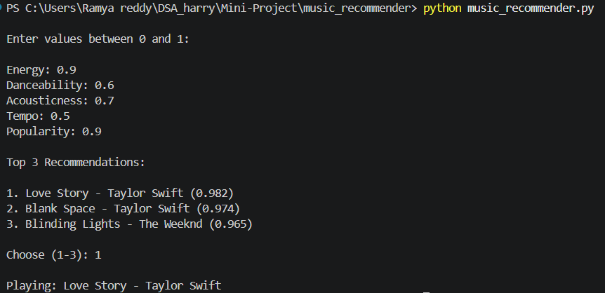

# Music Recommender System

A Python-based music recommendation system that suggests songs based on user preferences using cosine similarity.

## Features

- Recommends songs based on user input
- Uses cosine similarity for recommendation
- Integrates with YouTube Music
- Automatically opens selected song in browser
- Beginner-friendly machine learning concept implementation

## Technologies Used

- Python
- NumPy
- ytmusicapi
- Webbrowser module

## Project Structure

```text
music_recommender
 ├── music_recommender.py
 ├── README.md
 └── output.png
```

## How It Works

The user enters values between 0 and 1 for:

- Energy
- Danceability
- Acousticness
- Tempo
- Popularity

The system compares user preferences with stored song feature vectors using cosine similarity and recommends the top 3 matching songs.

## How to Run

### Install Dependencies

```bash
pip install numpy ytmusicapi
```

### Run Program

```bash
python music_recommender.py
```

## Sample Output




